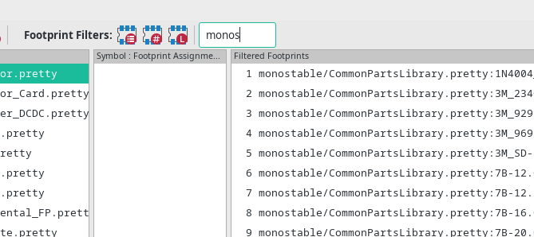

# KiCAD footprint collection [![][travis-svg]][travis]
This is a collection of all the KiCAD footprints I know of. If you know of any more, please let me know!
All the official libraries are included in the `KiCad/` sub-directory.

These are fairly regularily checked with [Travis CI][travis] to make sure KiCAD can load them.

Personally I use this with the footprint search that has been merged into the development (master) branch of KiCAD.



This repo uses git submodules.
A submodule is a way of including another git repo in your repo holding it at a particular version until you want to update it.
This is useful as you can easily keep a local copy of all the libraries, freeze them and only update when you want to.

## Usage

### Initialization


    git clone --branch stable https://github.com/monostable/kicad_footprints
    cd kicad_footprints && ./init

This downloads all the libraries in parallel but it can still take a while.

If you use a KiCAD nightly or development version you will get a few more footprints if you switch to the master branch:

    git checkout master && ./init

### Updating

If you want to update all libraries to their latest versions do:

    ./update

_Warning: `./update` will [`git reset --hard`](http://manpages.ubuntu.com/manpages/xenial/en/man1/git-reset.1.html) the submodules so don't make changes in these folders that you want to keep. Make a separate clone of the submodule respository for that._

If you want to pull in any libraries that have been added since your initial clone:

    git pull && ./init

### Registering with KiCAD

You can add these libraries manually through the KiCAD GUI of course. 
You could also use `generate_table` to generate an fp-lib-table, the file KiCAD uses as a footprint registry, with all the footprints from this repository.
You can use this to replace your existing fp-lib-table.
You will need to restart KiCAD for this change to take effect.

#### Linux

    cp ~/.config/kicad/fp-lib-table ~/.config/kicad/fp-lib-table.backup
    ./generate_table ~/.config/kicad/fp-lib-table

#### Mac OS

    cp ~/Library/Preferences/kicad/fp-lib-table ~/Library/Preferences/kicad/fp-lib-table.backup
    ./generate_table ~/Library/Preferences/kicad/fp-lib-table

#### Windows (using [git-bash](https://git-scm.com/download))

    cp ~/AppData/Roaming/kicad/fp-lib-table ~/AppData/Roaming/kicad/fp-lib-table.backup
    ./generate_table ~/AppData/Roaming/kicad/fp-lib-table

### Adding submodules

If you know of any KiCAD footprint repositories that have not been added please [file an issue](https://github.com/monostable/kicad_footprints/issues) and I will add them.

If you want to maintain a private fork of this repository with some private submodules you can add them simply by:

```
git submodule add <git url> <folder>
git commit
```

They should work fine with the rest of the scripts once they are added.

## License

Any scripts in this repository are MIT licensed. All the footprints have their own licenses of course.

[travis-svg]: https://api.travis-ci.org/monostable/kicad_footprints.svg?branch=stable
[travis]: https://travis-ci.org/monostable/kicad_footprints
